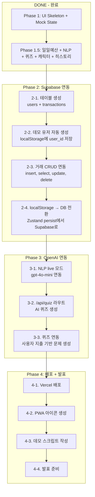

# 거지섬 (Gujisum) — 게이미피케이션 일일 예산 트래커

> **"예산은 계산 도구가 아니라, 행동을 유도하는 게임 규칙이다."**

---

## 프로젝트 개요

**거지섬**은 "섬이 가라앉기 전에 지출을 관리하세요!"라는 컨셉의 게이미피케이션 예산 트래커 PWA입니다.

- **핵심 엔진**: Visual Loss Engine — 지출이 늘어날수록 섬이 물에 잠김. 해수면 상승.
- **타겟**: 가계부 습관이 없는 Gen Z
- **UX 원칙**: 월 단위(감각 없음) 대신 **일 단위(체감 가능)** 예산 관리
- **개발 맥락**: 1-day 해커톤 MVP

---

## 핵심 게임 루프

```
채팅 입력 ("스타벅스 5000원")
    ↓
NLP 파싱 (mock 또는 gpt-4o-mini)
    ↓
거래 저장 (type, amount, category, description)
    ↓
일일 예산 비율 계산 (todaySpend / dailyBudget)
    ↓
섬 상태 변경
  - 0~40%   → sunny  (맑음)
  - 40~70%  → cloudy (흐림)
  - 70~100% → storm  (폭풍)
  - 100%+   → sunk   (침몰!)
    ↓
침몰 시 → 퀴즈 모달 → 정답 시 70%로 복구
```

**예산 공식:**
```
dailyBudget = monthlyBudget / 30
ratio = todaySpend / dailyBudget
```

**존 시스템:**
| 존 | 비율 | 섬 상태 | 날씨 |
|---|---|---|---|
| SAFE | 0~70% | safe | sunny → cloudy |
| WARNING | 70~100% | warning | storm |
| OVER | 100%+ | sunk | 침몰 + 퀴즈 |

---

## 기술 스택

| 기술 | 용도 | 버전 |
|---|---|---|
| **Next.js** | App Router, SSR/SSG | 16.1.6 |
| **TypeScript** | 타입 안전성 | ^5 |
| **Tailwind CSS** | 스타일링 | v4 |
| **shadcn/ui** | UI 컴포넌트 (Button, Card, Dialog, Input) | 3.8.4 |
| **Framer Motion** | 섬/물 애니메이션, 전환 효과 | 12.33.0 |
| **Zustand** | 전역 상태 관리 (persist middleware) | 5.0.11 |
| **Supabase** | DB (미연결, Phase 2 예정) | ^2.95.3 |
| **OpenAI** | NLP 파싱 (기본: mock 모드) | - |
| **Lucide React** | 아이콘 | 0.563.0 |

---

## 프로젝트 구조

```
ggumjisum/
├── public/
│   └── manifest.json              # PWA 매니페스트
├── src/
│   ├── app/                       # Next.js App Router
│   │   ├── api/nlp/route.ts       # POST: 한국어 거래 텍스트 NLP 파싱
│   │   ├── history/page.tsx       # 전체 거래 내역 페이지
│   │   ├── island/page.tsx        # 메인 섬 페이지 (핵심 화면)
│   │   ├── onboarding/page.tsx    # 온보딩 래퍼
│   │   ├── layout.tsx             # 루트 레이아웃 (폰트, 메타데이터, PWA)
│   │   ├── page.tsx               # / → /island 또는 /onboarding 리다이렉트
│   │   └── globals.css            # Tailwind + shadcn 테마 변수
│   ├── components/ui/             # shadcn/ui 컴포넌트
│   │   ├── button.tsx
│   │   ├── card.tsx
│   │   ├── dialog.tsx
│   │   └── input.tsx
│   ├── features/                  # 도메인별 기능 모듈
│   │   ├── chat/
│   │   │   └── ChatInterface.tsx  # 채팅 UI + /api/nlp 호출
│   │   ├── history/
│   │   │   └── TransactionList.tsx # 거래 목록 (편집/삭제/원문보기)
│   │   ├── island/
│   │   │   ├── IslandVisualizer.tsx # 섬 시각화 (물/하늘/날씨/게이지)
│   │   │   └── IslandCharacter.tsx  # 픽셀 캐릭터 + 상태별 대사
│   │   ├── onboarding/
│   │   │   └── OnboardingForm.tsx  # 3단계 온보딩 (닉네임/예산/리셋일)
│   │   └── rescue/
│   │       └── RescueQuizModal.tsx # 구조 퀴즈 (15문제, 셔플, 카테고리 기반)
│   ├── lib/
│   │   ├── env.ts                 # 환경변수 검증 + mock/live 플래그
│   │   └── utils.ts               # cn() 유틸 (tailwind-merge)
│   ├── store/
│   │   └── useStore.ts            # Zustand 스토어 (일일 예산 모델)
│   └── utils/
│       └── mock-nlp.ts            # Mock NLP 파서 (수입/지출 감지, 카테고리)
├── .env.local                     # 환경변수 (AI_MODE=mock 기본)
├── .env.example                   # 환경변수 템플릿
├── package.json
└── tsconfig.json
```

**아키텍처 규칙:**
- `features/` 간 직접 임포트 금지 (반드시 `lib/` 또는 `utils/`를 통해서)
- UI 컴포넌트: `components/`
- 비즈니스 로직: `features/` 또는 `utils/`
- DB/API 클라이언트: `lib/`
- 전역 상태: `store/`

---

## 데이터 모델

### User
```typescript
interface User {
  id: string;          // UUID
  nickname: string;    // 닉네임
  budget_limit: number; // 월 예산 (원)
  reset_day: number;   // 리셋일 (1~31) — 현재 미사용
}
```

### Transaction
```typescript
interface Transaction {
  id: string;            // UUID
  type: 'expense' | 'income';
  amount: number;        // 금액 (원)
  category: string;      // coffee|food|transport|drink|shopping|entertainment|health|etc
  description: string;   // NLP 요약 키워드
  original_input: string; // 사용자 입력 원문
  occurred_at: string;   // ISO 8601 타임스탬프
}
```

### Island Status
```typescript
type IslandStatus = 'safe' | 'warning' | 'sunk';
```

### Zustand Store 주요 상태
```typescript
// 핵심 상태
user: User | null
today_spend: number        // 오늘 지출 합계
last_spend_date: string    // "2026-02-09" — 날짜 바뀌면 자동 리셋
island_status: IslandStatus
transactions: Transaction[] // 최대 200개

// Computed
getDailyBudget()           // user.budget_limit / 30
getRatio()                 // today_spend / dailyBudget
getRemainingBudget()       // dailyBudget - today_spend
getWaterLevel()            // ratio * 100 (capped at 100)

// Actions
addTransaction(tx)         // 거래 추가 + spend 업데이트
updateTransaction(id, updates)  // 카테고리/설명 수정
deleteTransaction(id)      // 삭제 + spend 재계산
restoreIsland()            // 퀴즈 정답 시 → spend = dailyBudget * 0.7
ensureTodayReset()         // 날짜 변경 시 자동 리셋
```

### 영속성
- Zustand `persist` 미들웨어 → `localStorage` (키: `ggumjisum-storage`)
- Supabase 연동은 Phase 2 예정

---

## 라우트 맵

### 페이지
| 경로 | 파일 | 설명 |
|---|---|---|
| `/` | `app/page.tsx` | 유저 유무에 따라 리다이렉트 |
| `/onboarding` | `app/onboarding/page.tsx` | 닉네임 → 예산 → 리셋일 설정 |
| `/island` | `app/island/page.tsx` | 메인 화면 (섬 + 채팅 + 최근기록) |
| `/history` | `app/history/page.tsx` | 전체 거래 내역 (편집/삭제/원문) |

### API
| 메서드 | 경로 | 설명 |
|---|---|---|
| POST | `/api/nlp` | 한국어 텍스트 → `{type, amount, category, description}` |

---

## 현재 완료 상태 (Phase 1 + 1.5)

### Phase 1 — UI Skeleton + Mock State
- [x] Next.js 프로젝트 초기화 + Tailwind + shadcn/ui
- [x] 온보딩 폼 (3단계)
- [x] 섬 시각화 (픽셀 아트 SVG + Framer Motion)
- [x] 채팅 인터페이스 + Mock NLP
- [x] 구조 퀴즈 모달
- [x] Zustand 스토어 + localStorage 영속성

### Phase 1.5 — 일일 예산 모델 + 기능 강화
- [x] 월 예산 → 일일 예산 모델 전환 (`budget_limit / 30`)
- [x] 수입/지출 구분 (수입은 spend 차감)
- [x] NLP 파서 개선 (금액 파싱 강화, 조사 제거, 수입 키워드 정교화)
- [x] 카테고리 자동 분류 (8개 카테고리, 키워드 사전)
- [x] 키워드 요약 (조사/불용어/종결어미 제거)
- [x] 퀴즈 풀 확장 (15문제, 보기 셔플, 카테고리 기반 출제)
- [x] 섬 캐릭터 + 상태별 자동 대사 (6초 간격)
- [x] 가계부 페이지 (날짜 그룹핑, 편집, 삭제, 원문 보기)
- [x] /api/nlp 라우트 (mock/live 분기, rate limit)
- [x] 거래 수정/삭제 + spend 재계산

---

## 알려진 이슈

### 1. `ensureTodayReset` 앱 로드 시 미실행
- **현상**: `ensureTodayReset()`이 `addTransaction()` 내부에서만 호출됨
- **영향**: 다음 날 앱을 열어도 거래를 추가하기 전까지 어제의 `today_spend`가 남아있음
- **해결**: `/island` 페이지 로드 시 `ensureTodayReset()` 호출 추가

### 2. Supabase 미연결
- **현상**: 모든 데이터가 `localStorage`에만 저장됨
- **영향**: 브라우저 데이터 삭제 시 모든 기록 소실
- **해결**: Phase 2에서 Supabase 연동

### 3. `reset_day` 미사용
- **현상**: 온보딩에서 리셋일(1~31)을 입력받지만, 실제 리셋 로직에서 사용하지 않음
- **영향**: 월별 예산 리셋이 안 됨 (일일 리셋만 동작)
- **해결**: Phase 2에서 월별 리셋 로직 구현 (선택사항, MVP에서는 일일 모델로 충분)

---

## 환경변수 설정

```bash
# .env.local
NEXT_PUBLIC_AI_MODE=mock           # "mock" (기본, API 호출 없음) 또는 "live"
OPENAI_API_KEY=                    # live 모드에서만 필요
NEXT_PUBLIC_SUPABASE_URL=          # Phase 2에서 설정
NEXT_PUBLIC_SUPABASE_ANON_KEY=     # Phase 2에서 설정
```

**비용 안전 규칙:**
- `AI_MODE`는 반드시 `mock`이 기본값
- live 모드에서는 `gpt-4o-mini`만 사용
- `max_tokens: 200`, IP당 분당 20회 rate limit 적용
- OpenAI 호출은 서버 라우트 핸들러에서만 (클라이언트 직접 호출 금지)

---

## 실행 방법 (Quick Start)

```bash
# 1. 의존성 설치
cd ggumjisum
npm install

# 2. 환경변수 설정
cp .env.example .env.local
# .env.local 편집 (기본값은 mock 모드)

# 3. 개발 서버 시작
npm run dev

# 4. 브라우저에서 접속
open http://localhost:3000
```

**데모 시나리오 (1분):**
1. 온보딩: 닉네임 "부산", 월 예산 30만원, 리셋일 1일
2. 지출: "스타벅스 4500원" → 섬 45% (sunny)
3. 지출: "치킨 18000원" → 침몰! 🌊
4. 퀴즈 정답 → 섬 복구 (70%)
5. 수입: "용돈 20000원" → 초록색 표시
6. 가계부 아이콘 → 전체 내역 확인

---

## 앞으로의 제작 과정 (로드맵)



### Phase 2: Supabase 연동 (예상 2~3시간)

| 단계 | 작업 | 파일 |
|---|---|---|
| 2-1 | `users`, `transactions` 테이블 생성 + 인덱스 | Supabase Dashboard |
| 2-2 | 첫 방문 시 데모 유저 생성 → localStorage에 user_id | `lib/supabase.ts` (신규) |
| 2-3 | 거래 insert/select/update/delete | `lib/supabase.ts` + `store/useStore.ts` |
| 2-4 | Zustand persist → Supabase fallback 구조 | `store/useStore.ts` |

### Phase 3: OpenAI 연동 (예상 1~2시간)

| 단계 | 작업 | 파일 |
|---|---|---|
| 3-1 | `.env.local`에서 `AI_MODE=live` 전환 | `.env.local` |
| 3-2 | `/api/quiz` 라우트 생성 (mock + live) | `app/api/quiz/route.ts` (신규) |
| 3-3 | RescueQuizModal에서 API 호출 연동 | `features/rescue/RescueQuizModal.tsx` |

### Phase 4: 배포 + 마무리 (예상 1시간)

| 단계 | 작업 | 비고 |
|---|---|---|
| 4-1 | `vercel deploy` | Supabase URL + OpenAI key 환경변수 설정 |
| 4-2 | 192x192, 512x512 아이콘 생성 | `public/icon-192.png`, `public/icon-512.png` |
| 4-3 | 1분 데모 스크립트 정리 | — |
| 4-4 | 심사위원 질문 대비 | — |

---

## Cursor vs Claude Code 비교

| 항목 | Cursor | Claude Code |
|---|---|---|
| **인터페이스** | GUI IDE (파일 트리, 탭, 미리보기) | 터미널 기반 |
| **기획 논의** | Plan 모드로 명확히 분리 | 대화로 섞임 |
| **멀티파일 수정** | 하나씩 확인 필요 | 일괄 수정에 강함 |
| **시각적 확인** | 에디터 내 미리보기 | 브라우저 직접 확인 |
| **git 워크플로** | 수동 | 자연스러운 CLI 통합 |
| **컨텍스트 유지** | 대화 길어지면 잊기 쉬움 | CLAUDE.md로 영구 유지 |
| **scaffolding** | 유리 (npx, init 등) | 동일 |
| **비고** | Phase 1~1.5에 적합 | Phase 2~4에 적합 |

---

## Claude Code 작업 가이드

> 이 프로젝트를 Claude Code에서 이어서 작업할 때의 핵심 규칙

### 절대 규칙
1. **`NEXT_PUBLIC_AI_MODE=mock`** 기본값 유지. live 전환 시 반드시 수동으로.
2. **파일당 200줄 이하** 유지. 초과 시 분리.
3. **`features/` 간 직접 임포트 금지**. 반드시 `lib/` 또는 `utils/`를 통해서.
4. **OpenAI 호출은 서버 라우트 핸들러에서만**. 클라이언트 직접 호출 금지.
5. **비밀 키를 콘솔에 출력 금지**. `env.ts` 검증만 사용.

### 작업 순서
```
Phase 2 시작 → Supabase 대시보드에서 테이블 생성
→ lib/supabase.ts 작성
→ useStore.ts에 DB 연동 로직 추가
→ 빌드 확인 (npm run build)
→ Phase 3 진행
```

### 자주 쓸 명령어
```bash
npm run dev          # 개발 서버
npm run build        # 프로덕션 빌드 (타입 체크 포함)
npx shadcn add [컴포넌트]  # UI 컴포넌트 추가
```

### 카테고리 코드 참조
```
coffee | food | transport | drink | shopping | entertainment | health | etc
☕      🍚     🚕         🍺      🛍️        🎮              💊       💸
```

---

## 라이선스

해커톤 프로젝트 — 비상업적 용도
