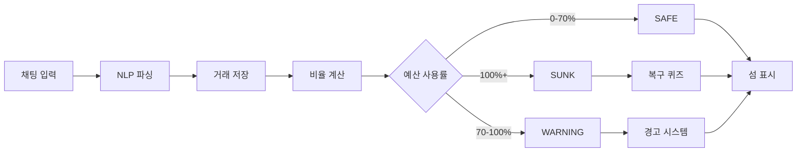

# 🏝️ 거지섬 (Ggumjisum)

<div align="center">

**하루 예산을 초과하면, 섬이 침몰한다!**

생존 게임형 가계부

[](https://nextjs.org/)
[](https://reactjs.org/)
[](https://www.typescriptlang.org/)
[](https://ggumjisum.vercel.app/)

[🌐 라이브 데모](https://ggumjisum.vercel.app/) | [📖 해커톤 제출 자료](./HACKATHON_SUBMISSION.md)

</div>

---

## 📸 스크린샷

### 랜딩 페이지

> Google 수준의 UI/UX로 프로젝트를 소개하는 랜딩 페이지

### 메인 앱 - 섬 가라앉기

> 지출할수록 섬이 실시간으로 물에 잠기는 Visual Loss Engine

### 5중 경각심 시스템

> 날씨, 파도, 경고등, HP바, 캐릭터까지 5가지 시각적 피드백

---

## 🎯 프로젝트 소개

### 핵심 컨셉
**"하루 예산을 초과하면, 섬이 침몰한다!"**

생존 게임형 가계부 - 예산을 지키며 섬을 발전시키는 긴박한 경험

### 문제 인식
Gen Z는 왜 가계부를 안 쓸까?
1. **월 단위는 감각이 없다** - 30일 뒤는 너무 멀어요
2. **숫자만 보여주면 지루하다** - 딱딱한 표와 그래프는 NO
3. **위기감이 없어서 통제 실패** - 숫자만으로는 행동을 바꾸기 어려움

### 솔루션: 생존 게임형 접근
**"내 섬이 침몰한다" = 즉각적인 위기감**

- 지출할수록 섬이 **실시간으로 물에 잠김**
- 단순한 숫자가 아닌 **시각적 손실**로 직관적 피드백
- **일일 예산 모델**: 오늘 하루에 집중하는 생존 경험

---

## ✨ 핵심 기능

### 🌊 5중 경각심 시스템
예산 사용률에 따라 5가지 시각적 피드백이 동시에 작동:

| 비율 | 날씨 | 파도 | 경고등 | HP바 | 캐릭터 |
|------|------|------|--------|------|--------|
| 0-30% | ☀️ 맑음 | 느림 | - | 초록 | 평온 |
| 30-70% | ⛅ 흐림 | 보통 | - | 노랑 | 불안 |
| 70-100% | ⛈️ 폭풍 | **3배 빠름** | ⚠️ 표시 | 빨강 | 위험 |
| 100%+ | 🌊 침몰 | 격렬 | 🆘 | 비어있음 | 휩쓸림 |

### 🏝️ 섬 진화 시스템
연속 절약 시 섬이 5단계로 진화:
- Lv.0 무인도 🏝️ (0일)
- Lv.1 텐트 ⛺ (3일)
- Lv.2 오두막 🏕️ (7일)
- Lv.3 작은 집 🏠 (14일)
- Lv.4 마을 🏘️ (30일)

### 💬 자연어 입력 (NLP)
"스타벅스 5000원" → 자동으로 파싱하여 카테고리 분류

### 👥 소셜 기능
- **리더보드**: 절약률 기준 실시간 랭킹
- **이웃 섬 방문**: 다른 사용자의 섬 구경 & 팁 공유

### 📊 분석 대시보드
- 주간/월간 지출 추이 그래프
- 카테고리별 지출 분석
- 절약률 트렌드

### 🔥 스트릭 시스템
- 연속 절약일 기록
- 3일/7일 달성 시 보상 잠금 해제

### 🎯 복구 퀴즈
예산 초과 시 퀴즈를 풀면 70% 지점으로 복구 가능

---

## 🛠️ 기술 스택

### Frontend
- **Framework**: Next.js 16 (App Router)
- **UI Library**: React 19
- **Language**: TypeScript 5
- **Styling**: Tailwind CSS 4
- **Animation**: Framer Motion 12
- **Charts**: Recharts 3

### Backend & Database
- **BaaS**: Supabase 2 (PostgreSQL)
- **Real-time Sync**: Supabase Realtime
- **Authentication**: Supabase Auth (준비 중)

### State Management
- **Global State**: Zustand 5
- **Persistence**: Zustand Persist Middleware

### Deployment
- **Hosting**: Vercel
- **CI/CD**: Vercel Auto Deploy

---

## 🚀 시작하기

### 사전 요구사항
- Node.js 18.17 이상
- npm 또는 yarn

### 설치 및 실행

```bash
# 저장소 클론
git clone https://github.com/wldnfkrhakfgo424-arch/ggumjisum.git
cd ggumjisum

# 의존성 설치
npm install

# 환경 변수 설정
cp .env.example .env.local
# .env.local 파일에 Supabase 키 입력

# 개발 서버 실행
npm run dev
```

브라우저에서 http://localhost:3000 접속

### 환경 변수

`.env.local` 파일에 다음 변수 설정:

```env
# AI Mode: "mock" (default) or "live"
NEXT_PUBLIC_AI_MODE=mock

# OpenAI (only if AI_MODE=live)
OPENAI_API_KEY=your_openai_api_key

# Supabase
NEXT_PUBLIC_SUPABASE_URL=your_supabase_url
NEXT_PUBLIC_SUPABASE_ANON_KEY=your_supabase_anon_key
```

---

## 📦 프로젝트 구조

```
ggumjisum/
├── src/
│   ├── app/                    # Next.js App Router
│   │   ├── page.tsx           # 랜딩 페이지
│   │   ├── onboarding/        # 온보딩 (닉네임, 예산 설정)
│   │   ├── island/            # 메인 앱
│   │   ├── leaderboard/       # 리더보드
│   │   ├── history/           # 분석 대시보드
│   │   └── api/               # API Routes
│   ├── features/              # 기능별 컴포넌트
│   │   ├── chat/             # 채팅 입력
│   │   ├── island/           # 섬 시각화
│   │   ├── onboarding/       # 온보딩 폼
│   │   ├── rescue/           # 복구 퀴즈
│   │   └── history/          # 분석 차트
│   ├── components/           # 공통 UI 컴포넌트
│   ├── store/                # Zustand Store
│   ├── lib/                  # 유틸리티
│   └── utils/                # Helper 함수
├── public/                   # 정적 파일
├── HACKATHON_SUBMISSION.md  # 해커톤 제출 자료
└── README.md                # 이 파일
```

---

## 🎮 핵심 게임 루프



**예산 공식**:
```typescript
dailyBudget = Math.floor(monthlyBudget / 30)
ratio = todaySpend / dailyBudget
waterLevel = Math.min(ratio * 100, 100)
```

---

## 🔧 주요 트러블슈팅

### 1. 소수점 화폐 표시 버그
**문제**: "3,000.333원" 같은 소수점 표시  
**해결**: `Math.floor()`로 정수 변환

### 2. 대화 말풍선이 물에 가려지는 문제
**문제**: z-index 스태킹 컨텍스트 이슈  
**해결**: 캐릭터와 말풍선을 별도 DOM 요소로 분리

### 3. 경고 타이머가 사라지지 않는 버그
**문제**: `useEffect` 의존성 배열 문제  
**해결**: 불필요한 의존성 제거

자세한 내용은 [HACKATHON_SUBMISSION.md](./HACKATHON_SUBMISSION.md#-3-기술적-문제-발생-시-해결-사례-troubleshooting)를 참조하세요.

---

## 📈 향후 계획

### 단기 (1개월)
- [ ] PWA 변환 (홈 화면 추가)
- [ ] 푸시 알림 시스템
- [ ] 더 많은 섬 테마

### 중기 (3개월)
- [ ] 실제 은행 연동 (Plaid API)
- [ ] AI 추천 시스템
- [ ] 커뮤니티 기능

### 장기 (6개월)
- [ ] iOS/Android 앱 (React Native)
- [ ] 수익화 (프리미엄 테마)
- [ ] 글로벌 확장 (다국어 지원)

---

## 🤝 기여하기

기여는 언제나 환영입니다!

1. Fork the Project
2. Create your Feature Branch (`git checkout -b feature/AmazingFeature`)
3. Commit your Changes (`git commit -m 'Add some AmazingFeature'`)
4. Push to the Branch (`git push origin feature/AmazingFeature`)
5. Open a Pull Request

---

## 📄 라이선스

이 프로젝트는 MIT 라이선스 하에 배포됩니다.

---

## 📧 연락처

프로젝트 링크: [https://github.com/wldnfkrhakfgo424-arch/ggumjisum](https://github.com/wldnfkrhakfgo424-arch/ggumjisum)

라이브 데모: [https://ggumjisum.vercel.app](https://ggumjisum.vercel.app)

---

## 🙏 감사의 말

- [Next.js](https://nextjs.org/) - 최고의 React 프레임워크
- [Framer Motion](https://www.framer.com/motion/) - 부드러운 애니메이션
- [Supabase](https://supabase.com/) - 완벽한 BaaS 플랫폼
- [Vercel](https://vercel.com/) - 최고의 배포 경험

---

<div align="center">

**거지섬에서 당신의 섬을 지켜보세요!** 🏝️

Made with ❤️ for Hackathon 2026

</div>
